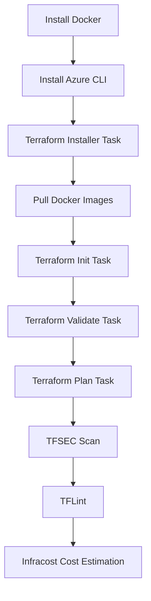

# InfraSecure-CostOps – CI Pipeline

This repository contains the CI pipeline for the **InfraSecure-CostOps** project.
The pipeline is implemented in **Azure DevOps Classic Editor** and integrates multiple DevOps tools such as Docker, Azure CLI, Terraform, security scanners, and Infracost for cost analysis.

---

## 🚀 Pipeline Overview

The pipeline (`Azure-session-Task01-CI`) automates the following stages:

1. **Install Docker** – Ensures Docker is installed on the build agent.
2. **Install Azure CLI** – Installs the Azure CLI for interacting with Azure resources.
3. **Install Terraform** – Installs Terraform using the Azure DevOps **Terraform Installer** task.
4. **Pull Required Docker Images** – Pulls base images (Alpine, Ubuntu, Nginx).
5. **Terraform Init** – Initializes Terraform backend and modules using Azure DevOps **TerraformCLI** task.
6. **Terraform Validate** – Validates Terraform syntax and configuration using Azure DevOps **TerraformCLI** task.
7. **Terraform Plan** – Generates an execution plan using Azure DevOps **TerraformCLI** task.
8. **Security Scans (TFSEC)** – Scans Terraform code for security issues.
9. **Linting (TFLint)** – Ensures Terraform code follows best practices.
10. **Infracost** – Estimates and reports infrastructure costs.

---

## 📂 Pipeline Steps

### 1. Install Docker

```bash
# Removes older versions
for pkg in docker.io docker-doc docker-compose docker-compose-v2 podman-docker containerd runc; do 
  sudo apt-get remove -y $pkg || true
done

# Install latest Docker Engine
sudo apt-get update -y
sudo apt-get install -y ca-certificates curl gnupg lsb-release
curl -fsSL https://download.docker.com/linux/ubuntu/gpg | sudo tee /etc/apt/keyrings/docker.asc > /dev/null
echo "deb [arch=$(dpkg --print-architecture) signed-by=/etc/apt/keyrings/docker.asc] https://download.docker.com/linux/ubuntu $(lsb_release -cs) stable" | sudo tee /etc/apt/sources.list.d/docker.list
sudo apt-get install -y docker-ce docker-ce-cli containerd.io docker-buildx-plugin docker-compose-plugin

# Verify installation
docker --version
```

### 2. Install Azure CLI

```bash
curl -sL https://packages.microsoft.com/keys/microsoft.asc | gpg --dearmor | \
    sudo tee /etc/apt/trusted.gpg.d/microsoft.gpg > /dev/null

AZ_REPO=$(lsb_release -cs)
echo "deb [arch=$(dpkg --print-architecture)] https://packages.microsoft.com/repos/azure-cli/ $AZ_REPO main" | \
    sudo tee /etc/apt/sources.list.d/azure-cli.list

sudo apt-get update -y
sudo apt-get install -y azure-cli
az --version
```

### 3. Install Terraform (Azure DevOps Task)

Use the **Terraform tool installer** provided by Azure DevOps:

```yaml
- task: TerraformInstaller@0
  inputs:
    terraformVersion: '1.7.5'
```

### 4. Pull Required Docker Images

```bash
docker pull alpine:latest
docker pull ubuntu:22.04
docker pull nginx:latest
docker images
```

### 5. Terraform Init (Azure DevOps Task)

```yaml
- task: TerraformCLI@0
  inputs:
    command: 'init'
    workingDirectory: '$(System.DefaultWorkingDirectory)'
```

### 6. Terraform Validate (Azure DevOps Task)

```yaml
- task: TerraformCLI@0
  inputs:
    command: 'validate'
    workingDirectory: '$(System.DefaultWorkingDirectory)'
```

### 7. Terraform Plan (Azure DevOps Task)

```yaml
- task: TerraformCLI@0
  inputs:
    command: 'plan'
    workingDirectory: '$(System.DefaultWorkingDirectory)'
    environmentServiceName: '<your-service-connection>'
```

### 8. TFSEC Security Scan

```bash
docker run --rm -v "$(System.DefaultWorkingDirectory):/src" aquasec/tfsec
```

### 9. TFLint

```bash
docker run --rm -v "$(System.DefaultWorkingDirectory):/data" -w /data ghcr.io/terraform-linters/tflint --init
```

### 10. Infracost – Cost Estimation

```bash
# Install Infracost
curl -fsSL https://raw.githubusercontent.com/infracost/infracost/master/scripts/install.sh | sh

# Export API Key (from pipeline variable)
export INFRACOST_API_KEY=$(INFRACOST_API_KEY)

# Convert Terraform plan to JSON
terraform show -json plan.out > plan.json

# Run cost breakdown
infracost breakdown --path plan.json --show-skipped
```

---

## ✅ Tools Used

* **Docker** – Container runtime
* **Azure CLI** – Manage Azure resources
* **Terraform (with Azure DevOps tasks)** – Infrastructure as Code (IaC)
* **TFSEC** – Security scanning
* **TFLint** – Linting and best practices
* **Infracost** – Cloud cost estimation

---

## 🔑 Notes

* Always use **Azure DevOps Terraform tasks (`TerraformInstaller@0`, `TerraformCLI@0`)** for Terraform operations (`install`, `init`, `validate`, `plan`) instead of running shell commands manually.
* Store sensitive values like **Azure Service Principal credentials** and **Infracost API Key** as **Azure DevOps Pipeline Variables/Secrets**.
* Ensure that the build agent (`azure-agent001`) supports Docker and has permissions for container scans.

---

## 📊 Pipeline Visualization



---


Do you also want me to add a **ready-to-use `azure-pipelines.yml`** that mirrors your classic pipeline so you can migrate in future, or should we keep it purely as documentation for now?
